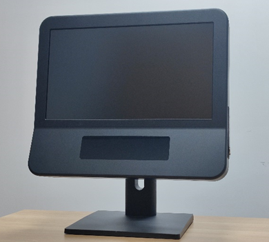

# Introduction of Pupilio

Pupilio is a lightweight Python package developed by Hangzhou Shennin Technology Co., Ltd. It is designed to drive and control the Pupil.IO Eye Tracker, offering a straightforward and user-friendly interface for ease of use. This tool allows for the control of eye-tracking data recording, calibration, and validation. Its calibration and validation UI can be seamlessly integrated with PsychoPy, PyGame, and other platforms.

## What's Pupil.IO

[Pupil.IO Homepage](https://www.deep-gaze.com/)

[Pupil.IO](https://www.deep-gaze.com/) is a high-performance, high-speed, and high-precision eye tracking system designed and produced by Hangzhou Shenning Technology Co., Ltd. It can offer high samping rate and precise eye movement data and pupil data, making it advanced tool for scientific and clinical applications.

## Specifications of Eye Tracker

| Attribute                | Specification                                 |
|--------------------------|-----------------------------------------------|
| Sample Rate              | 200 Hz [Firmware upgradable to 400 Hz]        |
| Accuracy                 | 0.5°                                          |
| Precision                | 0.03°                                         |
| Blink/Occlusion Recovery | 5 ms @ 200 Hz, 2.5 ms @ 400 Hz                |
| Head Box                 | 40 cm x 40 cm @ 70 cm                         |
| Operation Range          | 50 - 90 cm                                    |
| Gaze Signal Delay        | < 6 ms                                        |
| Tracking Technology      | Neural Network                                |
| Dimension                | 32 cm x 45 cm x 20 cm                         |
| Weight                   | 5 kg [Eye-tracker + Display + Compute Module] |
| Operating System         | Windows 11                                    |
| SDK                      | C/Python                                      |

