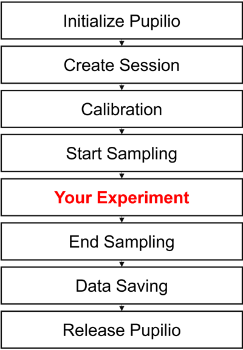

# Quick-Start

## Install Pupilio 

Currently, all eye trackers shipped with Pupilio are pre-configured with the necessary Pupilio Python packages. If we need to upgrade this package, please enter the following command in the command prompt or PowerShell window:

```bash
pip install pupilio
```

Once Pupilio is installed, enter the following command in the command prompt or PowerShell window:
```bash
python
>>> import pupilio 
```
If we see a window displaying pupilio version: ***, the installation was successful.

## Starting eye tracking

Our calibration user interface supports both Pygame and PsychoPy, which means we need to initialize a window and pass it to the Pupilio instance. For simplicity and convenience, let's start with Pygame:

```Python
# load PyGame library
import pygame
from pygame.locals import FULLSCREEN, HWSURFACE

# initialize PyGame
pygame.init()
# define the scree size
scn_width, scn_height = (1920, 1080)
# set a fullscreen mode with the above size
win = pygame.display.set_mode((scn_width, scn_height), FULLSCREEN|HWSURFACE)
```

Now that we have created a standard full-screen Pygame window, the next step is to call the eye tracker and perform the calibration：

```Python
# load Pupilio library
from pupilio import Pupilio

# instantiate a connection to the tracker
pupil_io = Pupilio()

# create a task session, and set a session name 
# If the session name contains spaces, 
# it is recommended to replace them with underscores '_'.
pupil_io.create_session(session_name="quick_start")

# calibration and validation (recommended)
# set 'validate' to True if we would like to verify the calibration results
pupil_io.calibration_draw(validate=True)
```


Next, with the calibration and validation code already implemented, we can begin collecting eye-tracking data using the following code:

```Python
# start retrieving gaze
pupil_io.start_sampling()
```

Assuming we have collected data for 20 seconds, we can save the collected data to a file using the following code:

```Python

# hang the main thread for 5 seconds by game
# eye tracking sampling are running on the background thread
pygame.time.wait(5 * 1000)

# stop eye tracking sampling
pupil_io.stop_sampling()

# sleep for 100 ms to capture ending samples
pygame.time.wait(100)

# save eye movement data
pupil_io.save_data("eye_movement.csv")
```

Finally, we need to clean up the resources used by Pupilio and close Pygame. Here's how we can do it:

```Python
# release the tracker instance
# clean up Pupilio resources
pupil_io.release()

# quit pygame
pygame.quit()
```

## Pupilio Workflow


Here is a flowchart illustrating the general workflow of Pupilio:


